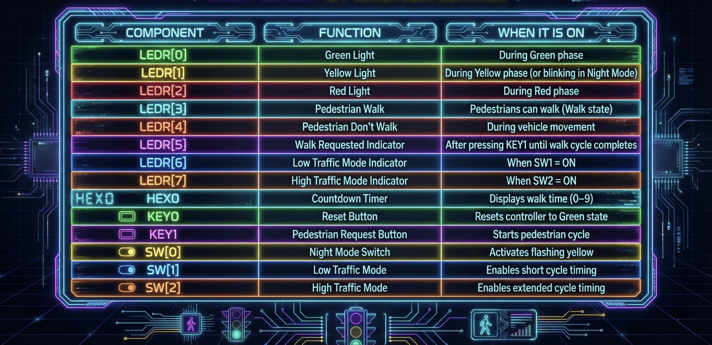
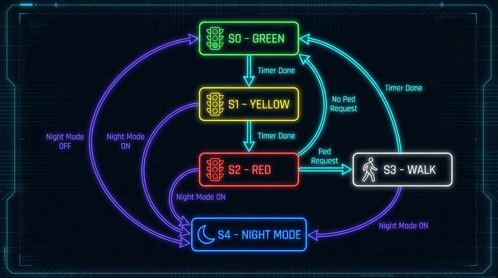

# 🚦 Smart Traffic Light Controller (FPGA – Verilog)

A **Smart Traffic Light Controller** implemented on the **Intel DE10-Lite FPGA** using **Verilog HDL** and **Intel Quartus Prime Lite**.  
The system manages vehicular and pedestrian traffic using a **Moore Finite State Machine (FSM)**, hardware timers, and mode-based control logic.

✔ Fully demonstrated on hardware  

---

## 🎯 Objective
To design and implement a **real-time FPGA-based traffic control system** that integrates **combinational and sequential logic**, safely handles pedestrian requests, and adapts traffic timing based on operational modes — demonstrating industry-relevant digital system design.

---

## 🧩 Features
- 🚥 Automatic **Green → Yellow → Red** traffic sequencing  
- 🚶 Pedestrian request button with **debounce + request latching**  
- ⏱️ Accurate phase timing using synchronous hardware counters  
- 🔢 Pedestrian walk countdown on **HEX display**  
- 🌙 **Night Mode** with continuous blinking yellow light  
- 🔀 **Low / High traffic modes** using board switches  
- 🧱 Fully modular Verilog design (FSM, timers, debouncer, blink logic)

---

## ⚙️ Hardware Components
| Component | Description |
|----------|-------------|
| **Intel DE10-Lite FPGA** | Main hardware platform |
| **On-board LEDs (LEDR)** | Traffic & pedestrian indicators |
| **Push Buttons (KEY)** | Reset and pedestrian request |
| **Slide Switches (SW)** | Mode selection |
| **HEX Display** | Walk countdown timer |
| **50 MHz Clock** | System clock source |

---

## 🔌 DE10-Lite Hardware Mapping

  
   
  <em>Figure: Mapping of DE10-Lite inputs/outputs to traffic controller functionality.</em>

---

## 💻 Design & Software Overview
**Languages & Tools**
- **Verilog HDL** – Digital logic design  
- **Intel Quartus Prime Lite** – Synthesis, compilation, FPGA programming  

**Key Modules**
| Module | Description |
|------|-------------|
| `traffic_fsm.v` | Moore FSM controlling system behavior |
| `phase_timer.v` | Parameterized traffic phase timers |
| `walk_countdown_timer.v` | Pedestrian countdown logic |
| `debounce_button.v` | Push-button debouncing |
| `blink_generator.v` | Night-mode blinking logic |
| `sevenseg_decoder.v` | HEX display driver |
| `traffic_top.v` | Top-level system integration |

---

## 🧠 System Logic (FSM Overview)

  
   
  <em>Figure: Moore FSM controlling traffic flow and pedestrian interaction.</em>

1. System starts in **Green** after reset  
2. Cycles through **Green → Yellow → Red** using hardware timers  
3. Pedestrian request is **latched** and serviced safely during Red  
4. **Walk state** enables countdown display and pedestrian signal  
5. After countdown completes, system returns to Green  
6. **Night Mode** overrides all states with blinking yellow  

---

## ⏱️ Timing Configuration

| Mode | Green | Yellow | Red |
|-----|-------|--------|-----|
| Normal | 7 s | 3 s | 5 s |
| Low Traffic | 5 s | 2 s | 4 s |
| High Traffic | 10 s | 3 s | 7 s |

(All timings are parameterized and adjustable in `traffic_top.v`)

---

## ▶️ How to Run (Quartus + DE10-Lite)
1. Install **Intel Quartus Prime Lite**
2. Open `project.qpf`
3. Compile the design
4. Program the DE10-Lite FPGA
5. Interact using:
   - **KEY0** → Reset  
   - **KEY1** → Pedestrian request  
   - **SW0** → Night Mode  
   - **SW1 / SW2** → Traffic modes  

---

## 🎥 Live Hardware Demo
▶️ **YouTube:**  
https://www.youtube.com/watch?v=zH9PwKlnD2A

> Recorded during final evaluation on DE10-Lite FPGA.

---

## 🧪 Testing & Validation
- Verified entirely on **hardware** (no simulation-only testing)
- All features demonstrated live to TA
- Edge cases tested:
  - Pedestrian request during active cycle  
  - Mode switching  
  - Reset during operation  

---

## 🧑‍💻 Author
**Shivam Gupta**  
🎓 B.Eng. Software Engineering @ York University  
🔗 [LinkedIn](https://linkedin.com/in/shivammmmg) • [Portfolio](https://shivammmmg.com)

---

## 📚 References
- EECS 3201 – Digital Logic Design (York University)
- Intel DE10-Lite User Manual
- Intel Quartus Prime Lite Documentation
